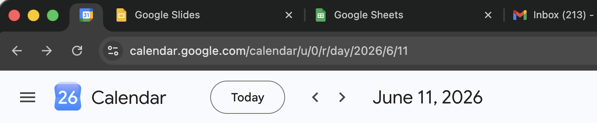

# Classic Workspace Favicons

A small Manifest V3 Chrome extension written in TypeScript. It restores older, easier-to-scan favicons on Google Workspace pages, including Gmail, Calendar, Drive, Docs, Sheets, Slides, Forms, Meet, Chat, Keep, Tasks, Contacts, and Voice.

The extension does not need network access or Chrome permissions. Icon sources are listed in `SOURCES.md`.

This is an unofficial browser extension and is not affiliated with, endorsed by, or sponsored by Google. Google product names and icons are trademarks of Google LLC.

## Preview



## Install in Chrome

The extension is already built in `unpacked/classic-workspace-favicons`.

1. Download this repository from GitHub and unzip it.
2. Open `chrome://extensions` in Chrome.
3. Enable **Developer mode**.
4. Click **Load unpacked**.
5. Select the `unpacked/classic-workspace-favicons` folder.
6. Reload any open Google app tabs.

If you are using this local checkout directly, this is the path to the Chrome extension folder you should select:

```text
/Users/YOUR_USERNAME/workspace/google-old-favicons-extension/unpacked/classic-workspace-favicons
```

Replace `YOUR_USERNAME` with your Mac username.

## Build

Only needed if you change the TypeScript source:

```sh
npm install
npm run build
```

## Package

```sh
npm run package
```

The upload ZIP is written to `classic-workspace-favicons.zip`.

## Chrome Web Store Notes

Use the neutral extension icon in `icons/` for the listing and toolbar icon. Do not use Google product icons as the extension logo or promotional tile.

Privacy policy: `PRIVACY.md`

Suggested short description:

> Restores older, easier-to-scan favicons on Google Workspace pages.

Suggested disclosure:

> This is an unofficial browser extension and is not affiliated with, endorsed by, or sponsored by Google. Google product names and icons are trademarks of Google LLC.
